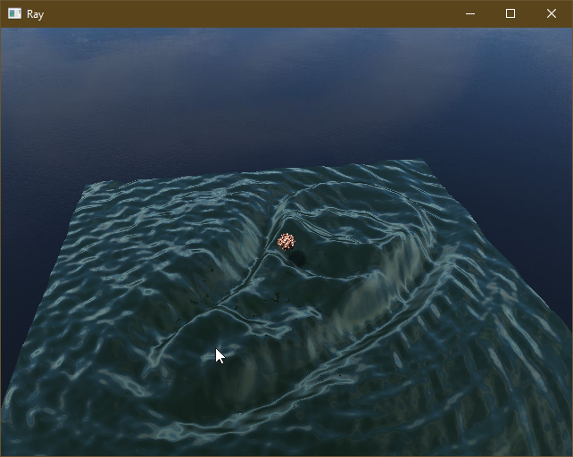

# OGLWater
Interactive water simulation built upon [flib](https://github.com/frontier789/flib). The object in the middle is a raymarched Mandelbulb with Phong shading. \
The water is rendered in two steps, first the intersection with the camera rays is found via rasterization then the reflected/refracted ray is raytraced. Finding the place where the mouse clicks is done with smooth color based picking.

## Usage
Running the application without arguments brings up a window with the simulation. Holding the left mouse button and dragging it rotates the view. Holding the right mouse button and moving the mouse generates waves from the mouse pointer. Time can be stopped or resumed by pressing space.

## Compilation
After cloning the repository `make` can be called from the root of the project to compile it. If flib is not installed in the default folder, the path to it can be specified as `make FPATH=path/to/flib` as eitherrelative or absolute path.

## Screenshots
[YouTube link](https://www.youtube.com/watch?v=SJSSsItuR0Y) click for video

